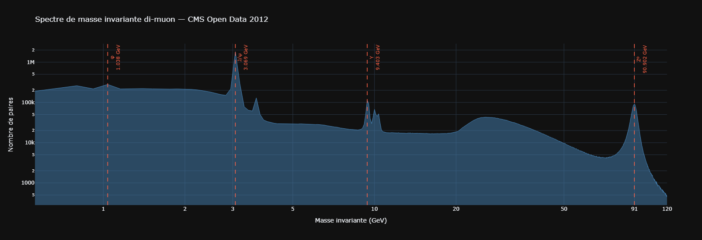
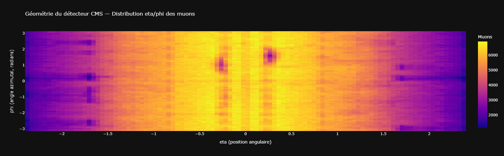

# CERN_LHC_Dataviz

Exploration de données publiques du LHC — ingestion, analyse et visualisation
de 61.5 millions de collisions proton-proton enregistrées par le détecteur CMS en 2012.

Ce projet part d'un constat simple : les données du CERN sont publiques et accessibles.
L'objectif était de voir si, sans connaissance particulière en physique des particules,
on pouvait ingérer ces données, les comprendre, et identifier quelque chose de significatif.

---

## Dataset

**Source** : [CERN Open Data Portal](https://opendata.cern.ch/record/6004)  
**Fichier** : `Run2012BC_DoubleMuParked_Muons.root` — 2 Go, format ROOT  
**Contenu** : 61 540 413 collisions proton-proton, variables muon uniquement  
**Format** : ROOT NanoAOD (format binaire propriétaire de la physique des hautes énergies)

---

## Stack technique

| Outil | Usage |
|-------|-------|
| `uproot` | Lecture du format ROOT sans dépendance ROOT |
| `awkward` | Manipulation des arrays de longueur variable |
| `PyArrow` | Conversion vers Parquet, écriture batch sur disque |
| `PySpark 4.1.1` | Calcul distribué sur les 23.7M paires filtrées |
| `scipy` | Détection automatique de pics et de clusters |
| `Plotly` | Visualisations interactives |
| `Python 3.12` | — |

---

## Structure du projet

```
CERN_LHC_Dataviz/
├── notebooks/
│   ├── cernviz.ipynb
│   ├── cern_events.ipynb         
├── exports/
│   ├── spectre_masse_invariante.png
│   └── heatmap_detecteur.png
├── requirements.txt
└── README.md
```

---

## Pipeline

```
Fichier ROOT (2 Go, 61.5M événements)
        ↓
  uproot — lecture par batch de 5M événements
        ↓
  Filtres : nMuon == 2 · charges opposées · 3 ≤ pt < 100 GeV · |eta| ≤ 2.4
        ↓
  PyArrow — écriture Parquet snappy sur disque (18 secondes)
        ↓
  PySpark — calcul masse invariante sur 23.7M paires
        ↓
  scipy + Plotly — détection de pics · visualisations
```

**Note sur l'ingestion** : une première approche via `pd.concat` de 13 batches
a été abandonnée après plus d'une heure sans résultat.
La solution retenue écrit chaque batch directement sur disque via PyArrow
sans jamais charger plus de 5M lignes en RAM simultanément.

---

## Résultats

### 1 — Spectre de masse invariante



En calculant la masse invariante de 22.8 millions de paires di-muon
et en traçant sa distribution, 4 pics émergent automatiquement
via `scipy.signal.find_peaks` 

| Particule | Masse détectée | Masse PDG | Écart | Découverte |
|-----------|---------------|-----------|-------|------------|
| φ | 1.038 GeV | 1.020 GeV | 1.76% | 1964 |
| J/ψ | 3.069 GeV | 3.097 GeV | 0.90% | 1974 — Prix Nobel 1976 |
| Υ | 9.403 GeV | 9.460 GeV | 0.60% | 1977 |
| Z⁰ | 90.902 GeV | 91.188 GeV | 0.31% | 1983 — Prix Nobel 1984 |

Les écarts diminuent avec la masse — les particules lourdes produisent
des muons plus énergétiques, donc mieux reconstruits par le détecteur.

### 2 — Géométrie du détecteur



La distribution eta/phi des 47.5M muons révèle la structure du détecteur lui-même.

**Asymétrie barrel/endcaps** : les bords (|eta| > 1.5) sont ~43% moins denses
que le barrel central — conséquence directe de la géométrie du détecteur.

**Zones froides locales** : `scipy.ndimage.label` détecte automatiquement
2 clusters de bins froids dans le barrel.

| Cluster | eta | phi |
|---------|-----|-----|
| A | -0.264 | 0.723 à 1.288 |
| B | +0.264 | 1.225 à 1.916 |

### 3 — Tentative de recréation d'évènements synthétiques à partir des données

Ce [Notebook](cern_events.ipynb) est une tentative de recréation de données synthétiques,
avec la volonté de voir s'il était possible d'approximer le distribution des évènements
en utilisant une méthode générative.
Les algorythmes utilisés ici ont été la KDE, une version améliorée de la KDE, et finalement le GMM.
Ces algorythmes ont tous montrés leur limite dans recréation de ces évènements.
Ce qui laisse à penser qu'une méthode plus sophistiquée soit nécessaire pour obtenir des résultats plus convaincants.

---

## Ce que ce projet n'est pas

Ce projet n'est pas une analyse de physique des particules.
Aucune correction de fond n'a été appliquée, aucun fit gaussien réalisé,
aucune significance statistique calculée.

L'objectif était uniquement d'ingérer
un un fichier scientifique volumineux, d'en explorer le contenu,
et d'en extraire des structures visibles et interprétables.

---

## Reproduire le projet

```bash
# Cloner le repo
git clone https://github.com/TGM-hub/CERN_LHC_Dataviz.git
cd CERN_LHC_Dataviz

# Installer les dépendances
pip install -r requirements.txt

# Télécharger le fichier ROOT (~2 Go)
mkdir -p data/raw
curl -L -o data/raw/Run2012BC_DoubleMuParked_Muons.root \
  https://sparkdltrigger.web.cern.ch/sparkdltrigger/Run2012BC_DoubleMuParked_Muons.root

```

---

## Données

Les données brutes (ROOT, Parquet) ne sont pas versionnées — trop volumineuses.
Le fichier ROOT est téléchargeable directement depuis le CERN Open Data Portal,
sous licence [Creative Commons CC0](https://creativecommons.org/publicdomain/zero/1.0/).
