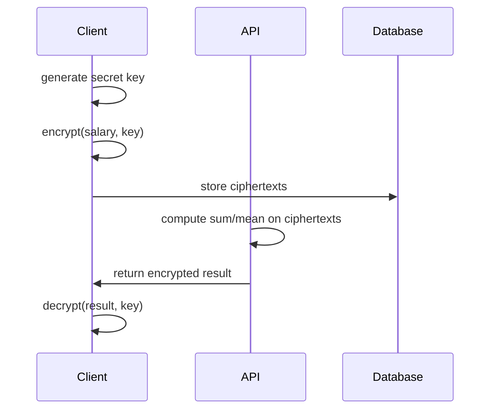

# Privacy-Preserving Analytics API

> Compute statistics on sensitive data without the server ever seeing raw values.


---

## How it works



The server computes on data it cannot read. Only the client holds the key.

The encryption scheme is additive:

```
encrypt(x)      = x + key
decrypt(sum, n) = sum - n * key
mean            = decrypt(sum, n) / n
```

---

## Project structure

```
crypto/         pure encryption logic, no external dependencies
api/            fastapi server, operates on ciphertexts only
database.py     sqlalchemy models and sqlite connection
run.py          seed script, encrypts and stores fake HR records
app.py          streamlit dashboard, decryption happens client-side
```

---

## Quick start

Clone the repo and install dependencies:

```bash
pip install -r requirements.txt
```

Seed the database with encrypted HR records:

```bash
python run.py
```

Start the API server:

```bash
uvicorn api.main:app --reload
```

Launch the dashboard:

```bash
streamlit run app.py
```

---

## Tech stack


---

## Important note

This project uses a simplified educational encryption scheme.
It demonstrates the architecture and principles of homomorphic encryption
but is not intended for production use.
